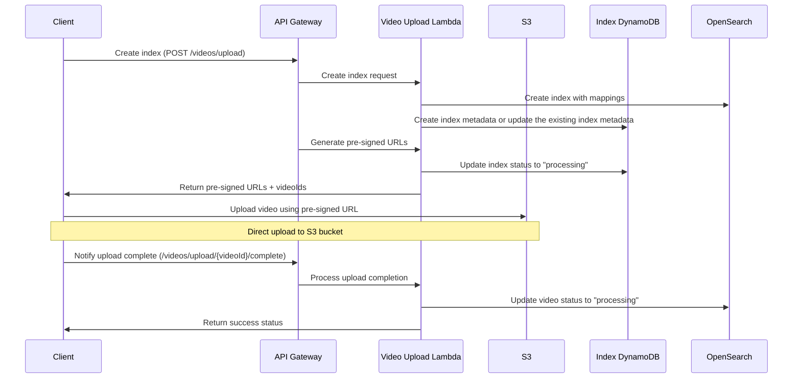
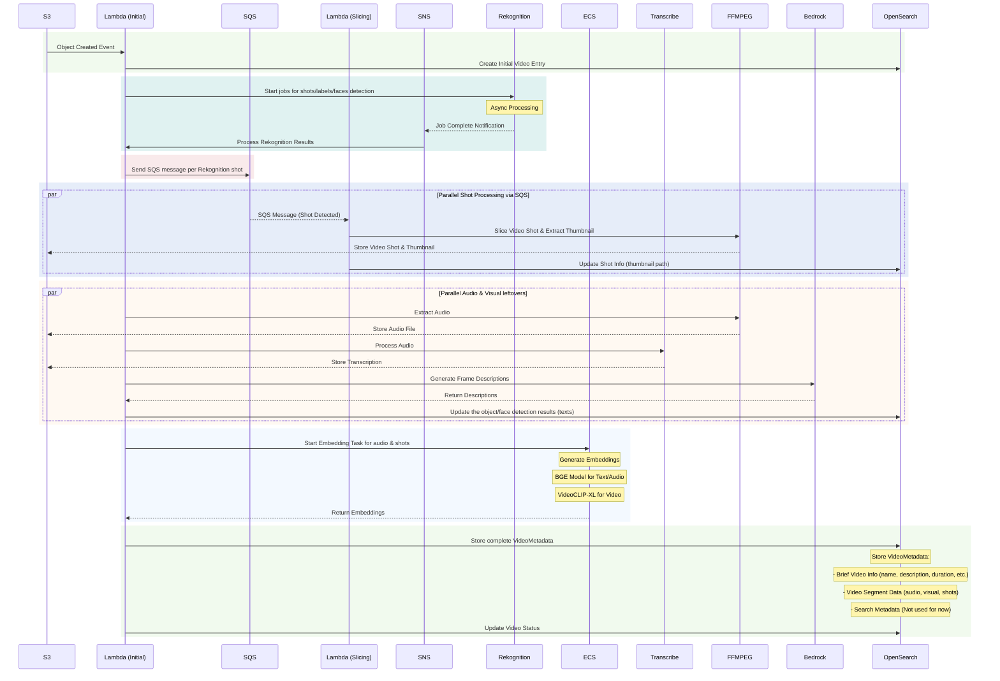
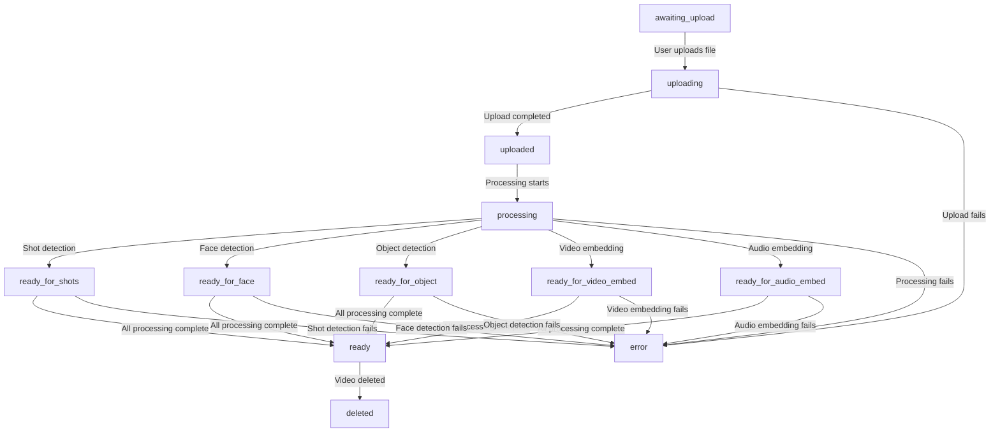
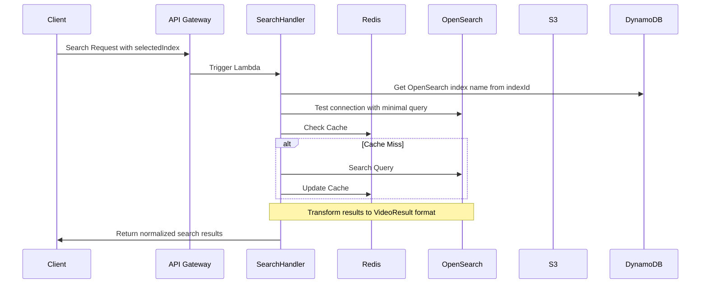
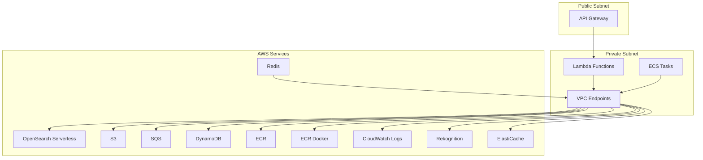

# shortvideo-online

## Search Service

### User Workflow
1. user input multimodal queries (text, audio, image) along with the video path (Youtube url for remote video and local video path for local video) to search video clips with the following options:
- exact keywords search according to the video audio or frames, e.g. user input the text "make america great again speech" or "hummingbird"
- fuzzy semantic expression search according to the video audio or frames, e.g. user input the text "all the slang prompted in the video" or "all the birds in the video"
- audio search, e.g. user input the audio with voice "make america great again speech"
- image search, e.g. user input the image of a hummingbird
- advanced hybrid search, e.g. user input the image of a Joe Biden and the audio of "make america great again speech", setting the weight of the audio to 0.3 and the image to 0.7

2. user will get output inlcude list of (top k) video clips along with the duration timestamp include the queries, in format of json
```json
{
    // Youtube url or local video path
    "video_path": "path/to/video",
    // SMPTE format
    "video_clips": [
        {"start_time": "00:00:12:34", "end_time": "00:00:56:78", "duration": "00:00:44:44", "top K": 5, "query": "hummingbird in the video"}
    ]
}
```

### Frontend
- Using Next.js, Tailwind CSS, Shadcn UI to build the frontend UI, the static assets are hosted on Cloudflare Pages and dynamic operation are operated by Cloudflare Workers and Function, leave the backend service to be operated by Amazon API Gateway, Lambda and ECS.
- The main page include a search bar to input the queries, multiple checkboxes to select the sources (Youtube, S3 etc.), and a button to trigger the search. 
- The search result will be displayed down below the search bar, in grid view for a list of raw videos with the timestamp and the duration, sorted with the most relevant video clips at the top.
- The user can hover on each raw video to see the brief video information and see the preview of the raw video, once the user check the checkbox of the raw video in the upper right corner, more details of the raw video will be shown on the right sidebar. Here user will see the detailed video metadata e.g. video title, description, duration, encoding format etc. at the top and the specific video segments that match the query at the bottom. User can click the video segments to play, and user will have the option to select the video segments and download the video segments.
- The whole theme is neat, concise with a modern look, responsive to different screen sizes.

#### Video Processing Flow:

1. **Initial Entry**
   - User accesses the system
   - Views existing indexes or starts new creation

2. **Index Creation (Step 1/2)**
   - Enter index name
   - Select AI models (Amazon NOVA/Transcribe)
   - Configure visual/audio options
   - Models cannot be changed after creation

3. **Upload Process (Step 2/2)**
   - Select or drag-and-drop video files
   - System validates:
     - Duration (4sec-30min/2hr)
     - Resolution (360p-4k)
     - File size (≤2GB)
     - Audio requirements

4. **Processing Stage**
   - Shows indexing progress
   - Displays preview thumbnails
   - Updates status in real-time

5. **Results View**
   - Displays processed videos
   - Shows index details
   - Provides access to video analysis

The interface follows a modern, clean design system with:
- Clear hierarchy
- Progressive disclosure
- Consistent spacing
- Material design influences
- Clear feedback mechanisms

### Backend Features

The backend is implemented using AWS CDK with TypeScript, providing a secure and scalable infrastructure.

#### Implementation Details

- **Local Video Upload**
  - Uses s3cmd for direct S3 upload
  - Better performance for large files
  - No API Gateway payload limitations
  - Progress tracking through s3cmd
  - Pre-signed URLs for secure uploads

- **YouTube Video Upload**
  - Handled through API Gateway
  - Uses YoutubeDL for downloading
  - Automatic metadata extraction
  - Queue-based processing

- **Common Processing**
  - Both flows converge to same processing pipeline
  - SQS queuing for async processing
  - OpenSearch indexing for search capabilities
  - Progress tracking through job status

#### Video Indexing

**Video Metadata Extraction**
Using S3 event notification to trigger the Lambda function to extract metadata from the video, including the raw audio, the raw image, the raw text description of the video and summary of the video. We first use Amazon Reckgnition to slice the raw video into multiple shots, then we extract the metadata from each shots, transform through the embedding model and store to Amazon OpenSearch.

Raw text, audio and image metadata extraction:
- Using Amazon Rekognition to slice the raw video into multiple shots and extract the metadata from each shots.
- Using FFMPEG to extract the audio from the video and store to Amazon S3 (audio).
- Using Amazon Transcribe to extract the text from the audio and store to Amazon S3 (text).
- Using FFMPEG to capture the video key frames intervally and store to Amazon S3 (image).
- Using Amazon Bedrock to extract the text description from the video key frames and store to Amazon S3 (text).

Raw video metadata extraction:
- Keep the original video resolution and frame rate and store to Amazon S3 (video).

**Video Metadata Embedding**
Embedding model for text, audio and image metadata extraction:
- Using BGE model for the text, audio and image metadata extraction.
```
hf_names=("InfiniFlow/bce-embedding-base_v1")
model_names=("bce-embedding-base")
commit_hashs=("00a7db29f2f740ce3aef3b4ed9653a5bd9b9ce7d")
```

-  Using alibaba-pai/VideoCLIP-XL for the video metadata embedding.
```
https://huggingface.co/alibaba-pai/VideoCLIP-XL/tree/main
```

**Video Metadata Injection**
Using Amazon Opensearch to store the video information and enable multimodal search capabilities. The schema is optimized for both exact keyword matching and semantic search across visual and audio content:

```typescript
// Video metadata types
export interface VideoMetadata {  
  video_index: string;              // Index ID
  video_description?: string;       // Original video description    
  video_duration?: string;          // Total video duration in "HH:MM:SS"
  video_id?: string;
  video_name?: string;              // Original file name
  video_source?: string;     // Youtube URL or local video path
  video_s3_path?: string;           // S3 storage location
  video_preview_url?: string;       // Pre-signed URL for thumbnail (video thumbnail)
  video_size?: number;              // File size in bytes
  video_status?: VideoStatus;       // Current processing status
  video_summary?: string;           // Video summary, AI generated
  video_tags?: string[];            // Tags for the video
  video_title?: string;             // Video title
  video_thumbnail_s3_path?: string; // S3 path to thumbnail (image)
  video_thumbnail_url?: string;     // Pre-signed URL for thumbnail (image thumbnail)
  video_type?: string;              // MIME type
  
  created_at?: string;              // ISO timestamp
  updated_at?: string;              // ISO timestamp
  error?: string;                   // Error message if processing failed
  segment_count?: number;           // Number of detected segments
  job_id?: string;                  // Job ID for the video processing
  
  video_metadata?: SearchMetadata;  // Quick search metadata
  video_segments?: VideoSegment[];  // Video segments
}

export type VideoStatus = 
  | 'awaiting_upload'   // Initial state when pre-signed URL is generated
  | 'uploading'         // File is being uploaded to S3
  | 'uploaded'          // File upload completed
  | 'processing'        // Video is being processed (slicing/indexing)
  | 'ready_for_face'    // Video completed face detection
  | 'ready_for_object'  // Video completed object detection
  | 'ready_for_shots'   // Video completed shot detection
  | 'ready_for_video_embed'   // Video completed video embedding
  | 'ready_for_audio_embed'   // Video completed audio embedding
  | 'ready'             // Video is fully processed and searchable
  | 'error'             // Processing failed
  | 'deleted';          // Video was deleted

export type WebVideoStatus = 
  | 'processing'
  | 'completed'
  | 'failed'

export interface VideoSegment {
  segment_id?: string;        // Segment ID, will be updated once in segment detection, in format of `${videoId}_segment_${segmentNumber}`,
  video_id: string;
  start_time: number;        // Milliseconds from start
  end_time: number;          // Milliseconds from start
  duration: number;          // Segment duration in milliseconds
  video_s3_path?: string;     // S3 storage location for each segment (shots)
  segment_audio?: {
    segment_audio_transcript?: string;     // Raw transcript text
    segment_audio_embedding?: number[];  // Audio embedding
    segment_audio_description?: string;    // Audio description
  };
  segment_visual?: {
    segment_visual_keyframe_path?: string;  // S3 path to keyframe, will obsolete to use video_s3_path instead
    segment_visual_description?: string;    // Visual description
    segment_visual_objects?: VisualObject[];
    segment_visual_faces?: FaceDetection[];
    segment_visual_embedding?: number[];    // Visual embedding
    segment_visual_ocr_text?: string[];    // Extracted text
  };
}

export interface VisualObject {
  label: string;
  confidence: number;
  bounding_box: BoundingBox;
}

export interface FaceDetection {
  person_name?: string;
  confidence: number;
  bounding_box: BoundingBox;
}

export interface BoundingBox {
  left: number;
  top: number;
  width: number;
  height: number;
}

// Quick search metadata
export interface SearchMetadata {
  exact_match_keywords: {
    visual: string[];    // All visual objects and faces
    audio: string[];     // Important phrases and keywords
    text: string[];      // OCR and caption text
  };
  semantic_vectors: {
    visual_embedding?: number[];  // Overall visual content vector
    text_embedding?: number[];    // Semantic text vector
    audio_embedding?: number[];   // Audio content vector
  };
}

export type ConfidencePreset = 'low' | 'medium' | 'high'
export type ConfidenceAdjustment = 'less' | 'default' | 'more'

export interface SearchOptions {
  visualSearch: boolean
  audioSearch: boolean
  minConfidence: number
  showConfidenceScores: boolean
  selectedIndex: string | null
  confidencePreset: ConfidencePreset
  confidenceAdjustment: ConfidenceAdjustment
}

// Processing job types
export interface VideoProcessingJob {
  videoId: string;
  bucket: string;
  key: string;
  metadata?: {
    fileName?: string;
    fileSize?: number;
    fileType?: string;
  };
}

// Add OpenSearch result type with confidence
export interface OpenSearchHit {
  _id: string;
  _score: number; // This is the OpenSearch confidence score
  _source: any;
}

// Align with the web frontend in frontend/types/index.ts
export interface VideoResult {
  id: string;
  indexId: string;  
  title: string;
  description: string;
  videoPreviewUrl: string;
  videoS3Path: string;
  videoDuration: string;
  videoThumbnailS3Path?: string;  // S3 path to thumbnail (image)
  videoThumbnailUrl?: string;     // Pre-signed URL for thumbnail (image thumbnail)
  source: 'local' | 'youtube';
  uploadDate: string;
  format: string;
  status: VideoStatus;
  size: number;
  segments: VideoSegment[];
  searchConfidence?: number; // Add OpenSearch confidence score
}
```

#### Video Search
The OpenSearch schema supports:
1. **Exact Keyword Search**:
   - Visual objects through `segment_visual_objects.label`
   - Face recognition through `segment_visual_faces.person_name`
   - Audio content through `segment_audio.segment_audio_transcript`
   - Text content through `segment_visual.segment_visual_ocr_text`
   - Pre-extracted keywords through `video_metadata.exact_match_keywords`

2. **Semantic Search**:
   - Visual similarity search using `segment_visual.segment_visual_embedding` and `video_metadata.semantic_vectors.visual_embedding`
   - Audio content similarity using `segment_audio.segment_audio_embedding` and `video_metadata.semantic_vectors.audio_embedding`
   - Text semantic search using `video_metadata.semantic_vectors.text_embedding`
   - AI-generated descriptions through `segment_visual.segment_visual_description` and `segment_audio.segment_audio_description`

3. **Multimodal Queries**:
   - Combined search across visual, audio, and text modalities using respective embeddings
   - Weighted multi-modal search using combined embeddings from `video_metadata.semantic_vectors`

Best practice for the selection between `segment_visual.segment_visual_embedding` and `video_metadata.semantic_vectors.visual_embedding` depends on your search requirements:
- Start with `video_metadata.semantic_vectors.visual_embedding` to quickly filter relevant videos
- Then use `segment_visual.segment_visual_embedding` to find specific matching segments within those videos

This two-step approach provides both efficiency and precision. For example, if searching for "a scene with a sunset over the ocean":
1. First use the global embedding to find videos that likely contain sunset scenes
2. Then use segment embeddings to pinpoint the exact moments where sunsets appear
3. Finally, use `segment_visual_objects.label` and confidence scores to verify the presence of specific objects

Same approach applies for audio and text search, using their respective global and segment-level embeddings.

### Backend Architecture

#### Resource Layer
1. **AI Services**
    - Using Amazon Reckognition for the shots detection and object detection.
    - Using Amazon Bedrock for the video summary and visual description.
    - Using Amazon Transcribe for the audio transcription.

2. **Network Architecture**
   - **VPC Configuration**
     - Private subnets for secure workloads
     - VPC Endpoints for AWS services:
       - OpenSearch Serverless
       - S3
       - SQS
     - No NAT Gateways needed due to VPC Endpoint usage

2. **Storage Layer**
   - **Amazon S3**
     - Prefix `RawVideos`: Original uploaded videos, e.g. `RawVideos/2024-12-13/video_1.mp4`
     - Prefix `ShotsVideos`: Prefix under `RawVideos`, processed shots with raw video name as prefix, e.g. `RawVideos/2024-12-13/video_1/ShotsVideos/short_1/short_1.mp4`
     - Prefix `ShotsVideosMetadata`: Prefix under `ShotsVideos`, processed shots metadata (shot_id, shot_start_time, shot_end_time, shot_duration, shot_audio_transcript, shot_visual_description, shot_visual_objects, shot_visual_faces) with raw video name as prefix, e.g. `RawVideos/2024-12-13/video_1/ShotsVideos/short_1/shot_1_metadata.json`
     - Prefix `ShotsVideosEmbedding`: Prefix under `ShotsVideos`, processed shots embedding (shot_visual_embedding, shot_text_embedding) with shot_id as prefix, e.g. `RawVideos/2024-12-13/video_1/ShotsVideos/short_1/shot_1_visual_embedding.json`, `RawVideos/2024-12-13/video_1/ShotsVideos/short_1/shot_1_text_embedding.json`

   - **Amazon OpenSearch Serverless**
     - VPC-only access through Interface Endpoints
     - Collection per environment
     - Security policies for IAM-based access
     - Network policies for VPC isolation

   - **Amazon Redis**
     - Cache the search results to Redis for faster retrieval

3. **Compute Layer**
   - **Amazon Lambda**
     - `VideoUploadHandler`: Handles video uploads using s3cmd
     - `VideoSliceHandler`: Triggered by S3 event notification, trigger the Amazon Reckognition to slice the raw video into multiple shots in async mode
     - `VideoSearchHandler`: Handles search requests to OpenSearch Serverless and cache the results to Redis
   - **Amazon ECS (Fargate)**
     - Service `VideoEmbeddingService`: Open Source model hosting and serving with auto-scaling capabilities
     - Job `VideoProcessingHandler`: Triggered by SQS event notification from Amazon Reckognition, refer the detailed in section **Video metadata extraction** and **Video Metadata Embedding**

4. **Message Queue**
   - **Amazon SQS**
     - Using SQS to receive the Amazon Reckognition video processing results
     - 30-minute visibility timeout and 14-day retention period with dead letter queue disabled

5. **API Layer**
   - **Amazon API Gateway**
     - REST API with stages per environment
     - CORS configuration
     - Lambda integration
     - X-Ray tracing and CloudWatch logging disabled


#### Workflow

1. **Local/Youtube Video Upload Flow**


2. **Video Indexing Flow**


The video status transition workflow:


3. **Search Flow**


4. **Network Flow**


1. Complete VPC isolation for OpenSearch Serverless
2. No internet access required for core services
3. Least privilege access through IAM roles
4. Network segmentation through security groups
5. Service-to-service communication through VPC endpoints

#### RESTful API

Overall API Path:
```http
    # Fixed index "videos"
   /videos/upload                         POST - Start upload
   /videos/upload/{videoId}/complete      POST - Complete upload
   /videos/youtube                        POST - YouTube upload
   /videos/{videoId} or /videos/          GET  - Get specific video details or all videos
   /videos/{videoId} or /videos/          DELETE - Delete specific video or all videos
   /videos/status/{videoId}               GET  - Check status, uploading, slicing, indexing, completed, failed
   /videos/search                         POST - Search videos

    # Dynamic index management
   /indexes                               POST - Create index, this may be handled by the /videos/upload endpoint
   /indexes/{indexId}                     GET - Get index details or delete index, including query status, search options, upload status
   /indexes/{indexId}                     POST - Upload videos to specific index
   /indexes/{indexId}                     DELETE - Delete index
```

##### Video Management
```http
# Upload or register new video
POST /api/v1/videos
Content-Type: multipart/form-data
{
    "video": binary,           # Video file upload
    "videoUrl": string,        # YouTube URL
    "metadata": {
        "title": string,
        "description": string,
        "tags": string[]
    }
}

# Get video metadata
GET /api/v1/videos/{videoId}
Response: {
    "videoId": string,
    "originalPath": string,
    "s3Path": string,
    "duration": string,
    "status": "processing|ready|failed",
    "metadata": object,
    "summary": string
}

# Delete video
DELETE /api/v1/videos/{videoId}
```

##### Search Operations
```http
# Multi-modal search
POST /api/v1/search
{
    "query": {
        "text": string,          # Text query
        "image": binary,         # Image query
        "audio": binary,         # Audio query
        "weights": {             # Optional weights for multi-modal search
            "visual": float,
            "audio": float,
            "text": float
        }
    },
    "filters": {
        "duration": {
            "min": string,
            "max": string
        },
        "objects": string[],     # Required objects
        "faces": string[],       # Required faces
        "keywords": string[]     # Required keywords
    },
    "pagination": {
        "offset": integer,
        "limit": integer
    }
}

# Get video segments
GET /api/v1/videos/{videoId}/segments
Response: {
    "segments": [{
        "segmentId": string,
        "startTime": string,
        "endTime": string,
        "duration": string,
        "keyframePath": string,
        "transcript": string,
        "objects": object[],
        "faces": object[]
    }]
}
```

##### Processing Operations
```http
# Get processing status
GET /api/v1/process/{jobId}/status
Response: {
    "jobId": string,
    "status": "queued|processing|completed|failed",
    "progress": float,           # 0 to 1
    "currentStage": string,      # e.g., "extracting_frames"
    "error": string,             # Error message if failed
    "completedSteps": string[],
    "remainingSteps": string[]
}

# Trigger reprocessing
POST /api/v1/videos/{videoId}/reprocess
{
    "steps": string[],          # Optional specific steps to reprocess
    "force": boolean            # Force reprocessing even if already processed
}
```

##### Analytics Operations
```http
# Get video analytics
GET /api/v1/videos/{videoId}/analytics
Response: {
    "viewCount": integer,
    "searchMatches": integer,
    "popularSegments": [{
        "segmentId": string,
        "matchCount": integer,
        "averageRelevance": float
    }],
    "commonQueries": [{
        "query": string,
        "count": integer
    }]
}
```

##### Health and Monitoring
```http
# System health check
GET /api/v1/health
Response: {
    "status": "healthy|degraded|down",
    "components": {
        "storage": {
            "s3": "healthy|degraded|down",
            "openSearch": "healthy|degraded|down"
        },
        "processing": {
            "fargate": "healthy|degraded|down",
            "lambda": "healthy|degraded|down"
        },
        "ai": {
            "bedrock": "healthy|degraded|down",
            "rekognition": "healthy|degraded|down",
            "transcribe": "healthy|degraded|down"
        }
    },
    "metrics": {
        "processingQueueSize": integer,
        "averageProcessingTime": float,
        "errorRate": float
    }
}
```

#### Storage Structure
```
s3://bucket-name/
├── RawVideos/
│   └── YYYY-MM-DD/
│       └── video index/
│           ├── video_id 1/
│           │   ├── abc.mp4
│           │   └── abc.jpg (thumbnail)
│           └── video_id 2/
│               ├── def.mp4
│               └── def.jpg (thumbnail)
├── ProcessedVideos/
│   └── YYYY-MM-DD/
│       └── video index/
│           ├── video_id 1/
|           |   └── segments/
|           |        └── abc_001.mp4
|           |        └── abc_001.jpg (thumbnail)
|           |        └── abc_002.mp4
|           |        └── abc_002.jpg (thumbnail)
|           └── video_id 2/
|               └── segments/
|                   └── def_001.mp4
|                   └── def_001.jpg (thumbnail)
|                   └── def_002.mp4
|                   └── def_002.jpg (thumbnail)
```

## Security & Performance

- **Upload Security**
  - Pre-signed URLs with short expiration
  - Client-side file validation
  - Server-side virus scanning
  - Content type verification
- **Access Control**
  - IAM roles for Lambda functions
  - Bucket policies for S3 access
  - API Gateway authentication
  - CORS configuration
- **Performance Optimization**
  - Multipart uploads for large files
  - s3cmd configuration tuning
  - Concurrent uploads
  - Progress monitoring
- **IAM Roles**
    - Lambda execution roles
    - ECS task roles
    - OpenSearch access roles
- **Security Groups**
    - OpenSearch access control
    - Redis access control
    - Lambda function access
- **VPC Endpoints**
    - Interface endpoints for AWS services
    - Private DNS enabled
    - Security group controls

## TODO
Backend:
- [ ] Add index deletion using /indexes/{indexId} DELETE

Frontend:
- [ ] Integrate actual query data to display the search result in the video bar under "View by Video" mode, refer to the README.md in the frontend folder
- [ ] View Details in the video card is not displaying the correct video detail but playing the video, need to fix it
- [ ] Remove the Reprocess button for now