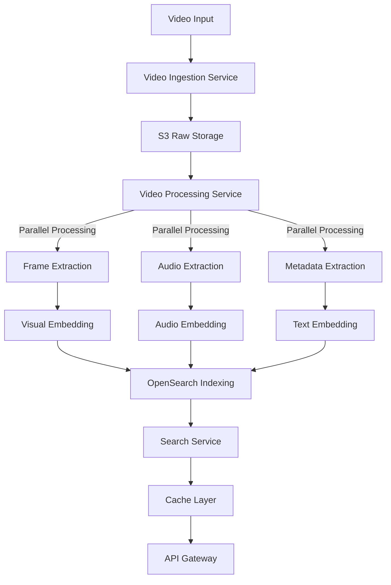
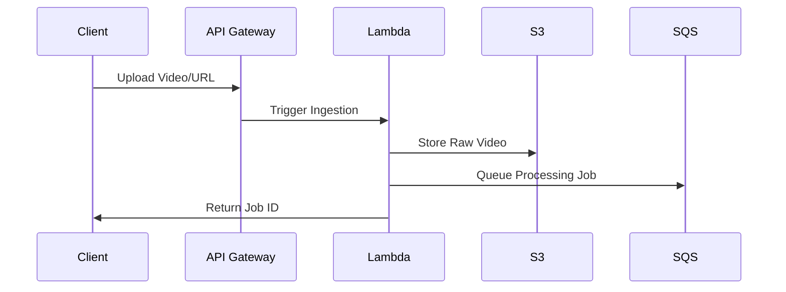
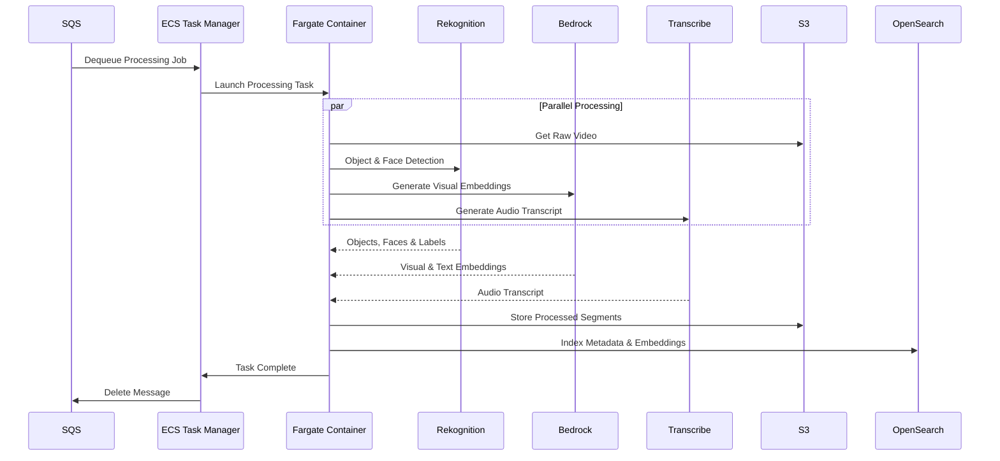

# shortvideo-online

## Search Service

### User Workflow
1. user input multimodal queries (text, audio, image) along with the video path (Youtube url for remote video and local video path for local video) to search video clips with the following options:
- exact keywords search according to the video audio or frames, e.g. user input the text "make america great again speech" or "hummingbird"
- fuzzy semantic expression search according to the video audio or frames, e.g. user input the text "all the slang prompted in the video" or "all the birds in the video"
- audio search, e.g. user input the audio with voice "make america great again speech"
- image search, e.g. user input the image of a hummingbird
- advanced hybrid search, e.g. user input the image of a Joe Biden and the audio of "make america great again speech", setting the weight of the audio to 0.3 and the image to 0.7

2. user will get output inlcude list of (top k) video clips along with the duration timestamp include the queries, in format of json
```json
{
    // Youtube url or local video path
    "video_path": "path/to/video",
    // SMPTE format
    "video_clips": [
        {"start_time": "00:00:12:34", "end_time": "00:00:56:78", "duration": "00:00:44:44", "top K": 5, "query": "hummingbird in the video"}
    ]
}
```

### Frontend
- Using Next.js, Tailwind CSS, Shadcn UI to build the frontend UI, the static assets are hosted on Cloudflare Pages and dynamic operation are operated by Cloudflare Workers and Function, leave the backend service to be operated by Amazon API Gateway, Lambda and ECS.
- The main page include a search bar to input the queries, multiple checkboxes to select the sources (Youtube, S3 etc.), and a button to trigger the search. 
- The search result will be displayed down below the search bar, in grid view for a list of raw videos with the timestamp and the duration, sorted with the most relevant video clips at the top.
- The user can hover on each raw video to see the brief video information and see the preview of the raw video, once the user check the checkbox of the raw video in the upper right corner, more details of the raw video will be shown on the right sidebar. Here user will see the detailed video metadata e.g. video title, description, duration, encoding format etc. at the top and the specific video segments that match the query at the bottom. User can click the video segments to play, and user will have the option to select the video segments and download the video segments.
- The whole theme is neat, concise with a modern look, responsive to different screen sizes.

### Backend Features

#### Download Video
Using [YoutubeDL](https://github.com/ytdl-org/youtube-dl) to download the video from Youtube URL and store to Amazon S3. To consider the performance, we will use Amazon Cloudwatch Event to trigger the Lambda function to crawl the video specific Youtube category (e.g. trending, music, gaming, etc.) and store to Amazon S3.

#### Video Extraction
Using S3 event notification to trigger the Lambda function to extract metadata from the video, including the raw audio, the raw image, the raw text description of the video and summary of the video.
- Using FFMPEG to extract the audio from the video.
- Using Amazon Transcribe to extract the text from the audio.
- Using FFMPEG to capture the video key frames intervally and send to Amazon Bedrock for image extraction.
- Using Amazon Bedrock summarize the video content into a short paragraph.

#### Video Metadata Storage
Using Amazon Opensearch to store the video information and enable multimodal search capabilities. The schema is optimized for both exact keyword matching and semantic search across visual and audio content:

```json
{
    "video_id": "string",  // Unique identifier for the video
    "video_original_path": "string",  // Youtube URL or local video path
    "video_s3_path": "string",  // S3 storage location
    "video_title": "string",  // Video title
    "video_description": "string",  // Original video description    
    "video_duration": "string",  // Total video duration in SMPTE format
    "video_summary": "string",  // Video summary, AI generated
    // Here the video segment is general concept of the video shot, which is "a series of interrelated consecutive pictures taken contiguously by a single camera and representing a continuous action in time and space. "
    "video_segments": [
        {
            "segment_id": "string",
            "segment_start_time": "string",  // SMPTE format
            "segment_end_time": "string",    // SMPTE format
            "segment_duration": "string",  // SMPTE format
            "segment_audio": {
                "segment_audio_transcript": "string",  // Raw transcript text
                "segment_audio_semantic_embedding": [0.0],  // Audio embedding
                "segment_audio_description": "string"  // Audio description, AI generated
            },
            "segment_visual": {
                "segment_visual_keyframe_path": "string",  // S3 path to keyframe
                "segment_visual_description": "string",  // Visual description, AI generated
                // Object detection results
                "segment_visual_objects": [
                    {
                        "label": "string",  // Object label (e.g., "hummingbird", "person")
                        "confidence": "float",
                        "bounding_box": {
                            "left": "float",
                            "top": "float",
                            "width": "float",
                            "height": "float"
                        },
                    }
                ],
                // Face detection results
                "segment_visual_faces": [
                    {
                        "person_name": "string",  // Identified person (e.g., "Joe Biden")
                        "confidence": "float",
                        "bounding_box": {
                            "left": "float",
                            "top": "float",
                            "width": "float",
                            "height": "float"
                        }
                    }
                ],
                "segment_visual_embedding": [0.0],  // Visual embedding for image similarity search
                "segment_visual_ocr_text": ["string"]  // Extracted text from images
            }
        }
    ],
    // Quick search data - used for initial search
    "video_metadata": {
        "exact_match_keywords": {
            "visual": ["string"],  // All visual objects and faces for exact matching
            "audio": ["string"],   // Important phrases and keywords from audio
            "text": ["string"]     // OCR and caption text for exact matching
        },
        "semantic_vectors": {
            "visual_embedding": [0.0],  // A numerical vector representing the overall visual content of the video. Used for finding visually similar videos or when searching with an image query.
            "text_embedding": [0.0],    // A numerical vector representing the semantic meaning of all text content. Used for fuzzy text search where exact matches aren't required (e.g., searching for "birds" might match "parrots" or "hummingbirds").
            "audio_embedding": [0.0]    // A numerical vector representing the audio content. Used for finding videos with similar audio content or when searching with an audio query.
        }
    }
}
```

#### Video Search
The OpenSearch schema supports:
1. **Exact Keyword Search**:
   - Visual objects through `segment_visual_objects.label`
   - Face recognition through `segment_visual_faces.person_name`
   - Audio content through `segment_audio.segment_audio_transcript`
   - Text content through `segment_visual.segment_visual_ocr_text`
   - Pre-extracted keywords through `video_metadata.exact_match_keywords`

2. **Semantic Search**:
   - Visual similarity search using `segment_visual.segment_visual_embedding` and `video_metadata.semantic_vectors.visual_embedding`
   - Audio content similarity using `segment_audio.segment_audio_semantic_embedding` and `video_metadata.semantic_vectors.audio_embedding`
   - Text semantic search using `video_metadata.semantic_vectors.text_embedding`
   - AI-generated descriptions through `segment_visual.segment_visual_description` and `segment_audio.segment_audio_description`

3. **Multimodal Queries**:
   - Combined search across visual, audio, and text modalities using respective embeddings
   - Weighted multi-modal search using combined embeddings from `video_metadata.semantic_vectors`

Best practice for the selection between `segment_visual.segment_visual_embedding` and `video_metadata.semantic_vectors.visual_embedding` depends on your search requirements:
- Start with `video_metadata.semantic_vectors.visual_embedding` to quickly filter relevant videos
- Then use `segment_visual.segment_visual_embedding` to find specific matching segments within those videos

This two-step approach provides both efficiency and precision. For example, if searching for "a scene with a sunset over the ocean":
1. First use the global embedding to find videos that likely contain sunset scenes
2. Then use segment embeddings to pinpoint the exact moments where sunsets appear
3. Finally, use `segment_visual_objects.label` and confidence scores to verify the presence of specific objects

Same approach applies for audio and text search, using their respective global and segment-level embeddings.

#### Backend Architecture

1. **Storage Layer**
   - **Amazon S3**
     - `raw-videos/`: Original uploaded videos
     - `processed-videos/`: Processed video segments
     - `keyframes/`: Extracted video frames
     - `audio/`: Extracted audio files
     - `embeddings/`: Pre-computed embeddings
   - **Amazon OpenSearch**
     - Video metadata and search indices
     - Vector embeddings for similarity search
     - Real-time search capabilities
   - **Amazon ElastiCache (Redis)**
     - Search results caching
     - Hot segment caching
     - Processing status tracking

2. **Compute Layer**
   - **Amazon Lambda**
     - `video-download`: YouTube video download handler
     - `video-segment`: Video segmentation processor
     - `embedding-generator`: Generates embeddings for all modalities
     - `search-handler`: Handles search requests
     - `metadata-processor`: Processes and indexes video metadata
   - **Amazon ECS (Fargate)**
     - Long-running video processing tasks
     - Heavy computational workloads
     - Parallel processing orchestration

3. **AI/ML Layer**
   - **Amazon Bedrock**
     - Text embedding generation
     - Visual embedding generation
     - Video content summarization
   - **Amazon Transcribe**
     - Audio transcription
     - Speaker identification
   - **Amazon Rekognition**
     - Object detection
     - Face detection and recognition
     - Scene analysis

#### Workflow

Overall workflow of the backend service:


Video Injestion:


Video Processing:


### RESTful API Endpoints

#### Video Management
```http
# Upload or register new video
POST /api/v1/videos
Content-Type: multipart/form-data
{
    "video": binary,           # Video file upload
    "videoUrl": string,        # YouTube URL
    "metadata": {
        "title": string,
        "description": string,
        "tags": string[]
    }
}

# Get video metadata
GET /api/v1/videos/{videoId}
Response: {
    "videoId": string,
    "originalPath": string,
    "s3Path": string,
    "duration": string,
    "status": "processing|ready|failed",
    "metadata": object,
    "summary": string
}

# Delete video
DELETE /api/v1/videos/{videoId}
```

#### Search Operations
```http
# Multi-modal search
POST /api/v1/search
{
    "query": {
        "text": string,          # Text query
        "image": binary,         # Image query
        "audio": binary,         # Audio query
        "weights": {             # Optional weights for multi-modal search
            "visual": float,
            "audio": float,
            "text": float
        }
    },
    "filters": {
        "duration": {
            "min": string,
            "max": string
        },
        "objects": string[],     # Required objects
        "faces": string[],       # Required faces
        "keywords": string[]     # Required keywords
    },
    "pagination": {
        "offset": integer,
        "limit": integer
    }
}

# Get video segments
GET /api/v1/videos/{videoId}/segments
Response: {
    "segments": [{
        "segmentId": string,
        "startTime": string,
        "endTime": string,
        "duration": string,
        "keyframePath": string,
        "transcript": string,
        "objects": object[],
        "faces": object[]
    }]
}
```

#### Processing Operations
```http
# Get processing status
GET /api/v1/process/{jobId}/status
Response: {
    "jobId": string,
    "status": "queued|processing|completed|failed",
    "progress": float,           # 0 to 1
    "currentStage": string,      # e.g., "extracting_frames"
    "error": string,             # Error message if failed
    "completedSteps": string[],
    "remainingSteps": string[]
}

# Trigger reprocessing
POST /api/v1/videos/{videoId}/reprocess
{
    "steps": string[],          # Optional specific steps to reprocess
    "force": boolean            # Force reprocessing even if already processed
}
```

#### Analytics Operations
```http
# Get video analytics
GET /api/v1/videos/{videoId}/analytics
Response: {
    "viewCount": integer,
    "searchMatches": integer,
    "popularSegments": [{
        "segmentId": string,
        "matchCount": integer,
        "averageRelevance": float
    }],
    "commonQueries": [{
        "query": string,
        "count": integer
    }]
}
```

#### Health and Monitoring
```http
# System health check
GET /api/v1/health
Response: {
    "status": "healthy|degraded|down",
    "components": {
        "storage": {
            "s3": "healthy|degraded|down",
            "openSearch": "healthy|degraded|down"
        },
        "processing": {
            "fargate": "healthy|degraded|down",
            "lambda": "healthy|degraded|down"
        },
        "ai": {
            "bedrock": "healthy|degraded|down",
            "rekognition": "healthy|degraded|down",
            "transcribe": "healthy|degraded|down"
        }
    },
    "metrics": {
        "processingQueueSize": integer,
        "averageProcessingTime": float,
        "errorRate": float
    }
}
```