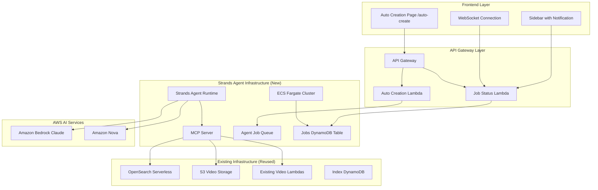
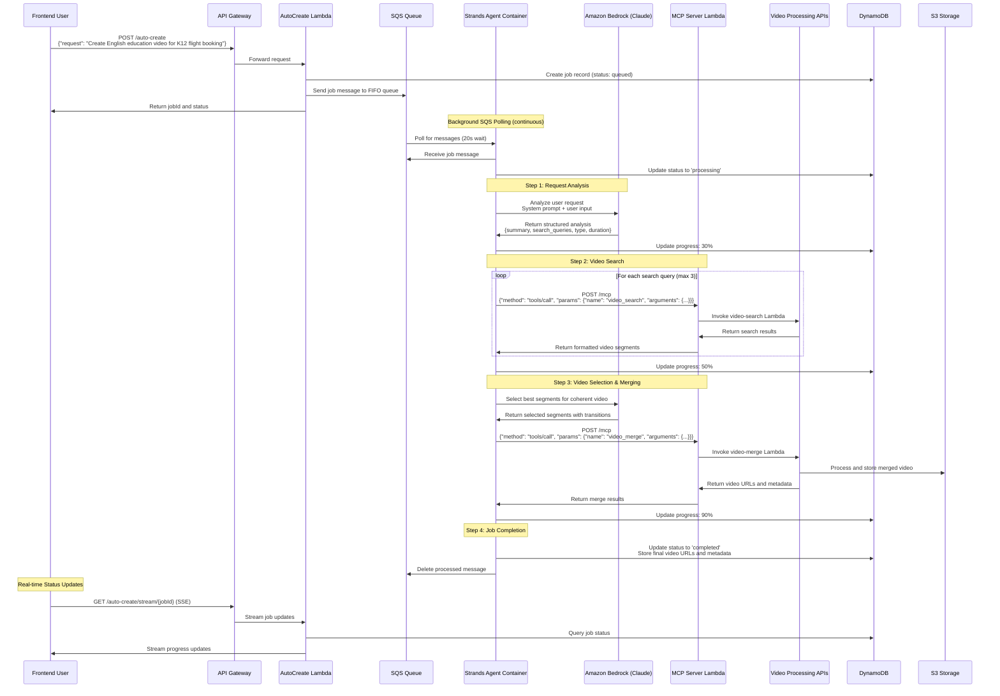

# Autonomous Video Creation Feature - Implementation Plan

## Overview
Design and implement an autonomous video creation feature that allows users to create short videos using natural language requests. The system will leverage Amazon Strands Agents on ECS Fargate to orchestrate video processing tasks while integrating with the existing video platform infrastructure.

## Architecture Requirements Summary
- **Frontend**: New dedicated `/auto-create` route with full-screen interface
- **Backend**: Amazon Strands Agent framework on ECS Fargate
- **Infrastructure**: Reuse existing AWS resources (VPC, OpenSearch, S3) with separate compute/orchestration
- **User Experience**: Hybrid real-time processing with live updates and background job capability
- **Integration**: Seamless access to existing video library and processing capabilities

## System Architecture



## Implementation Plan

### Phase 1: Frontend Development

#### 1.1 Auto Creation Page Setup
- **Location**: `prototype/frontend/app/auto-create/page.tsx`
- **Components**:
  - Main input area for natural language requests
  - Real-time progress display with streaming logs
  - Results preview with video thumbnail and description
  - Job history and status management

#### 1.2 Sidebar Integration
- **Update**: `prototype/frontend/components/Sidebar.tsx`
- **Features**:
  - Add "Auto Creation (Preview)" navigation item
  - Notification badge for completed jobs
  - Job status indicator

#### 1.3 WebSocket Integration
- **Purpose**: Real-time progress updates and streaming logs
- **Implementation**: Server-Sent Events (SSE) or WebSocket connection
- **Features**: Live status updates, progress bars, log streaming

### Phase 2: Backend Infrastructure

#### 2.1 Strands Agent Setup
- **Location**: New CDK stack `lib/strands-agent-stack.ts`
- **Components**:
  - ECS Fargate cluster for Strands Agent runtime
  - Application Load Balancer for agent endpoints
  - Auto Scaling configuration
  - VPC integration with existing infrastructure

#### 2.2 MCP Server Development
- **Purpose**: Provide tools for video operations to Strands Agent
- **Tools to Implement**:
  - `video_search`: Search existing video library
  - `video_merge`: Merge video segments
  - `video_slice`: Extract video clips
  - `video_metadata`: Get video information
  - `index_query`: Query video indexes

#### 2.3 Job Management System
- **DynamoDB Table**: Store job status, progress, and results
- **SQS Queue**: Queue agent processing jobs
- **Lambda Functions**:
  - Job creation and queuing
  - Status polling and updates
  - WebSocket/SSE message handling

### Phase 3: Agent Implementation

#### 3.1 Strands Agent Configuration
```python
# Example agent configuration
agent_config = {
    "name": "video_creation_agent",
    "model": "anthropic.claude-3-sonnet-20240229-v1:0",
    "tools": [
        "video_search",
        "video_merge", 
        "video_slice",
        "video_metadata",
        "index_query"
    ],
    "system_prompt": """You are a video creation assistant that helps users create short videos from existing video libraries. 
    You can search for relevant video content, extract clips, and merge them based on natural language requests."""
}
```

#### 3.2 Complete Workflow: User Input → Final Video Response


#### 3.3 Detailed Processing Steps

**Phase 1: Job Initiation & Queuing**
- User submits natural language request via frontend
- AutoCreate Lambda creates job record in DynamoDB with TTL
- Job message sent to SQS FIFO queue for reliable processing
- User receives jobId for real-time tracking

**Phase 2: Strands Agent Processing**
- Agent continuously polls SQS queue using long polling (20s)
- Receives job message and updates status to 'processing'
- Initiates multi-step video creation workflow with progress tracking

**Phase 3: Claude Analysis**
- Agent sends user request to Amazon Bedrock (Claude)
- Claude analyzes intent and generates structured response:
  - Summary of user requirements
  - 2-3 optimized search queries
  - Video type classification (educational, entertainment, etc.)
  - Duration preferences and key themes

**Phase 4: MCP Server Video Operations**
- Agent calls MCP server via HTTP POST with JSON-RPC format
- MCP server executes video tools by invoking existing Lambda functions:
  - `video_search`: Searches video library with confidence scoring
  - `video_merge`: Merges segments with transitions using FFmpeg
  - `video_slice`: Extracts specific clips based on criteria
- Each tool maps parameters and standardizes responses

**Phase 5: Intelligent Video Assembly**
- Claude selects optimal segments for coherent narrative flow
- Agent orchestrates video merging with appropriate transitions
- Final video processed and stored in S3 with thumbnails
- Metadata and URLs stored in DynamoDB

**Phase 6: Real-time User Experience**
- Frontend receives live updates via Server-Sent Events (SSE)
- Progress bars, status indicators, and streaming logs
- Completed video displayed with download/share options
- Job history maintained for user reference

### Phase 4: Integration & Testing

#### 4.1 API Endpoints
```typescript
// New API endpoints to implement
interface AutoCreateAPI {
  'POST /auto-create': {
    body: {
      request: string;           // Natural language request
      userId: string;
      options?: {
        maxDuration: number;     // Maximum video duration
        preferredIndexes: string[]; // Preferred video indexes
        outputFormat: string;    // Output format preferences
      }
    };
    response: {
      jobId: string;
      status: 'queued' | 'processing' | 'completed' | 'failed';
      estimatedDuration?: number;
    }
  };
  
  'GET /auto-create/jobs/{jobId}': {
    response: {
      jobId: string;
      status: string;
      progress: number;
      logs: string[];
      result?: {
        videoUrl: string;
        thumbnailUrl: string;
        description: string;
        duration: number;
      };
    }
  };
  
  'GET /auto-create/stream/{jobId}': {
    response: 'text/event-stream'; // SSE for real-time updates
  };
}
```

#### 4.2 Error Handling & Fallbacks
- Graceful degradation when agent services are unavailable
- Retry mechanisms for failed processing steps
- User-friendly error messages and recovery options
- Timeout handling for long-running jobs

## Detailed Component Specifications

### Frontend Components

#### Auto Creation Page (`/auto-create`)
```typescript
interface AutoCreatePageProps {
  // Main creation interface
}

interface CreationFormProps {
  onSubmit: (request: string, options?: CreationOptions) => void;
  isProcessing: boolean;
}

interface ProgressDisplayProps {
  jobId: string;
  status: JobStatus;
  progress: number;
  logs: string[];
  onCancel?: () => void;
}

interface ResultsPreviewProps {
  result: {
    videoUrl: string;
    thumbnailUrl: string;
    description: string;
    duration: number;
  };
  onDownload: () => void;
  onShare: () => void;
}
```

#### Sidebar Notification System
```typescript
interface NotificationBadgeProps {
  count: number;
  type: 'success' | 'error' | 'processing';
}

interface JobStatusIndicatorProps {
  jobs: AutoCreateJob[];
  onJobClick: (jobId: string) => void;
}
```

### Backend Components

#### MCP Server Tools
```python
class VideoSearchTool:
    """Search existing video library using natural language queries"""
    
    async def execute(self, query: str, indexes: List[str] = None) -> List[VideoResult]:
        # Implementation using existing video-search Lambda
        pass

class VideoMergeTool:
    """Merge multiple video segments into a single video"""
    
    async def execute(self, segments: List[VideoSegment], options: MergeOptions) -> MergedVideo:
        # Implementation using existing video-merge Lambda
        pass

class VideoSliceTool:
    """Extract specific clips from videos based on time ranges or content"""
    
    async def execute(self, video_id: str, criteria: SliceCriteria) -> List[VideoSegment]:
        # Implementation using existing video processing
        pass
```

#### Job Management
```typescript
interface AutoCreateJob {
  jobId: string;
  userId: string;
  request: string;
  status: 'queued' | 'processing' | 'completed' | 'failed';
  progress: number;
  createdAt: string;
  completedAt?: string;
  logs: string[];
  result?: {
    videoUrl: string;
    thumbnailUrl: string;
    description: string;
    duration: number;
    s3Path: string;
  };
  error?: string;
  estimatedDuration?: number;
}
```

## File Structure

```
├── lib/
│   └── strands-agent-stack.ts          # New CDK stack for Strands infrastructure
├── src/
│   ├── lambdas/
│   │   ├── auto-create/                # New Lambda functions
│   │   │   ├── index.ts               # Job creation and management
│   │   │   ├── status.ts              # Job status and streaming
│   │   │   └── package.json
│   │   └── mcp-server/                # MCP server implementation
│   │       ├── index.ts               # MCP server main
│   │       ├── tools/                 # Video operation tools
│   │       │   ├── video_search.ts
│   │       │   ├── video_merge.ts
│   │       │   ├── video_slice.ts
│   │       │   └── video_metadata.ts
│   │       └── package.json
│   └── containers/
│       └── strands-agent/             # Strands Agent container
│           ├── Dockerfile
│           ├── agent_config.py
│           ├── main.py
│           └── requirements.txt
├── prototype/frontend/
│   ├── app/
│   │   └── auto-create/               # New auto-create page
│   │       ├── page.tsx
│   │       └── components/
│   │           ├── CreationForm.tsx
│   │           ├── ProgressDisplay.tsx
│   │           ├── ResultsPreview.tsx
│   │           └── JobHistory.tsx
│   ├── components/
│   │   ├── auto-create/               # Auto-creation specific components
│   │   │   ├── NotificationBadge.tsx
│   │   │   ├── JobStatusIndicator.tsx
│   │   │   └── StreamingLogs.tsx
│   │   └── Sidebar.tsx                # Updated with notifications
│   └── lib/
│       └── auto-create/               # Auto-create utilities
│           ├── api.ts
│           ├── websocket.ts
│           ├── types.ts
│           └── hooks.ts
```

## Infrastructure Requirements

### ECS Fargate Configuration
```yaml
# Strands Agent Service Configuration
Service:
  TaskDefinition:
    CPU: 2048
    Memory: 4096
    ContainerDefinitions:
      - Name: strands-agent
        Image: strands-agent:latest
        Environment:
          - BEDROCK_REGION: us-east-1
          - MCP_SERVER_URL: http://mcp-server:8000
          - OPENSEARCH_ENDPOINT: ${existing_opensearch_endpoint}
          - S3_BUCKET: ${existing_video_bucket}
        PortMappings:
          - ContainerPort: 8080
            Protocol: tcp
  
  NetworkConfiguration:
    VpcId: ${existing_vpc_id}
    Subnets: ${existing_private_subnets}
    SecurityGroups:
      - ${strands_agent_security_group}
```

### DynamoDB Table Schema
```typescript
interface AutoCreateJobsTable {
  PrimaryKey: {
    jobId: string;    // Partition key
    userId: string;   // Sort key
  };
  Attributes: {
    status: string;
    progress: number;
    request: string;
    createdAt: string;
    completedAt?: string;
    logs: string[];
    result?: object;
    error?: string;
    ttl: number;      // Auto-cleanup after 30 days
  };
  GlobalSecondaryIndexes: {
    UserIdIndex: {
      PartitionKey: 'userId';
      SortKey: 'createdAt';
    };
    StatusIndex: {
      PartitionKey: 'status';
      SortKey: 'createdAt';
    };
  };
}
```

### Deployment Architecture

```
┌──────────────────────────────────────────────────────────────┐
│                    VideoSearchStack                          │
├──────────────────────────────────────────────────────────────┤
│  ┌─────────────────┐    ┌──────────────────────────────────┐ │
│  │   API Gateway   │    │        StrandsAgentConstruct     │ │
│  │                 │    │                                  │ │
│  │ /videos/*       │    │  ┌─────────────────────────────┐ │ │
│  │ /search         │    │  │      ECS Fargate            │ │ │
│  │ /indexes/*      │    │  │   ┌─────────────────────┐   │ │ │
│  │ /auto-create/*  │◄───┼──┼───┤  Strands Agent      │   │ │ │
│  │ /mcp            │    │  │   │  (Python FastAPI)   │   │ │ │
│  └─────────────────┘    │  │   └─────────────────────┘   │ │ │
│                         │  └─────────────────────────────┘ │ │
│                         │                                  │ │
│                         │  ┌─────────────────────────────┐ │ │
│                         │  │     Lambda Functions        │ │ │
│                         │  │  ┌─────────┬─────────────┐  │ │ │
│                         │  │  │AutoCreate│ MCP Server │  │ │ │
│                         │  │  │ Lambda  │   Lambda    │  │ │ │
│                         │  │  └─────────┴─────────────┘  │ │ │
│                         │  └─────────────────────────────┘ │ │
│                         │                                  │ │
│                         │  ┌─────────────────────────────┐ │ │
│                         │  │   Storage & Queuing         │ │ │
│                         │  │  ┌─────────┬─────────────┐  │ │ │
│                         │  │  │DynamoDB │    SQS      │  │ │ │
│                         │  │  │ Jobs    │   Queue     │  │ │ │
│                         │  │  └─────────┴─────────────┘  │ │ │
│                         │  └─────────────────────────────┘ │ │
│                         └──────────────────────────────────┘ │
│                                                              │
│  ┌─────────────────────────────────────────────────────────┐ │
│  │              Shared Infrastructure                      │ │
│  │  VPC • OpenSearch • S3 • DynamoDB • Cognito             │ │
│  └─────────────────────────────────────────────────────────┘ │
└──────────────────────────────────────────────────────────────┘
```

## Implementation Timeline

### Week 1-2: Infrastructure Setup
- Set up Strands Agent ECS infrastructure
- Implement basic MCP server with video tools
- Create DynamoDB tables and SQS queues
- Configure VPC integration and security groups

### Week 3-4: Frontend Development  
- Build auto-create page and components
- Implement WebSocket/SSE for real-time updates
- Update sidebar with notifications
- Create job history and management interface

### Week 5-6: Agent Development
- Configure Strands Agent with video creation capabilities
- Implement processing workflow and error handling
- Test agent tool integration
- Optimize agent prompts and decision-making

### Week 7-8: Integration & Testing
- End-to-end testing of the complete workflow
- Performance optimization and error handling
- User acceptance testing and refinements
- Documentation and deployment preparation

## Security Considerations
- **Authentication**: Integrate with existing Cognito authentication
- **Authorization**: Role-based access to video creation features
- **Data Privacy**: Ensure user requests and generated content are properly isolated
- **API Security**: Rate limiting and input validation for all endpoints
- **Infrastructure Security**: VPC isolation and security group restrictions

## Future Enhancements
- **Multi-language Support**: Extend natural language processing to multiple languages
- **Advanced Video Effects**: Integration with additional video processing capabilities
- **Template System**: Pre-built video creation templates for common use cases
- **Batch Processing**: Support for bulk video creation requests
- **API Integration**: External API access for programmatic video creation