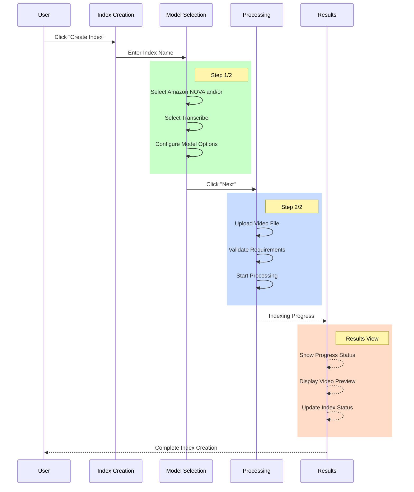
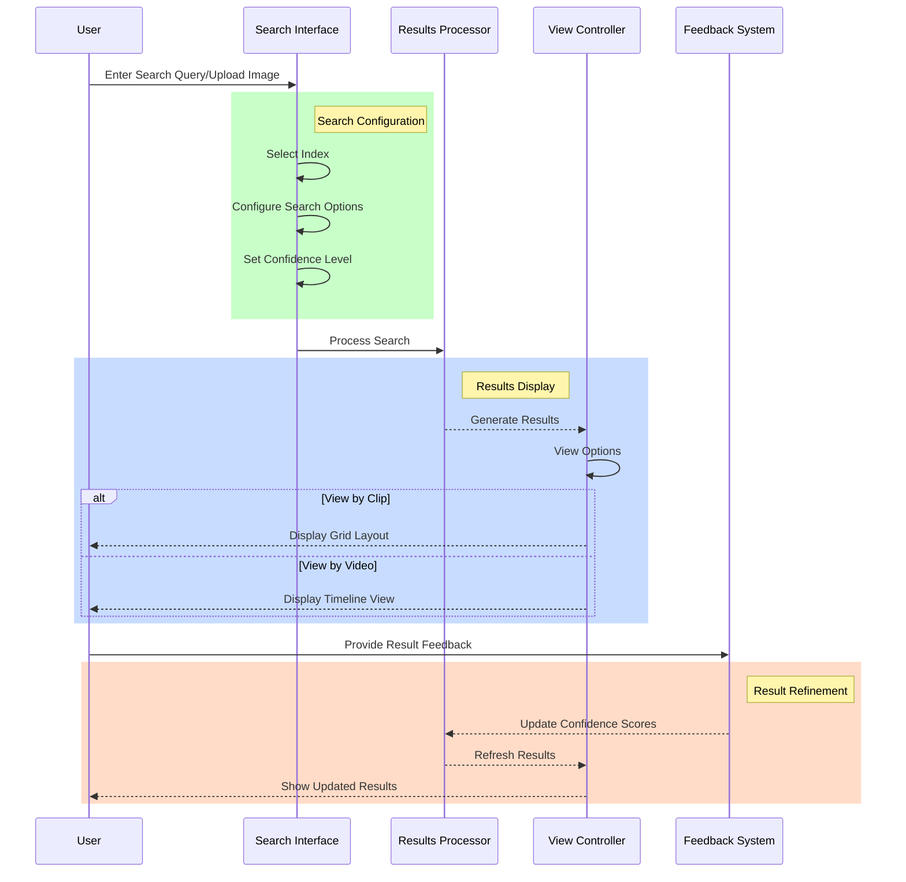

## Index Creation Overview:
User tutorial from upload image/video, set index parameter/embedding model, progress panel for ongoing job and detailed page for indexed image or video. Each step layout and element in detail are described below.

### Step 1: Upload image/video Page
- Step indicator (2/2)
- Index selector dropdown
- Large drop zone for file upload
- Detailed specification panel
- Upload requirements clearly listed
- Action buttons at bottom

### Step 2: Index Creation Page
- Step indicator (1/2)
- Form layout with:
  - Text input for index name
  - Warning message about model selection
  - Model selection cards with detailed specifications
  - Navigation buttons (Cancel/Next)
- Clear visual hierarchy with cards and icons

### Step 3: Progress Panel
- Tab navigation between "My videos" and "Sample videos"
- Free plan notification banner with learn more link
- Two-column layout:
  - Left: Create index CTA card
  - Right: Index preview card with creation date
- Material design influenced UI elements

### Step 4: Index Detail Page
- Header with index name and ID
- Two-model display (Amazon NOVA and VideoCLIP-XL) with visual/audio indicators
- Status panel showing video count and indexing progress
- Preview thumbnail of video being processed
- Clean, minimal design with dark mode support


Overall workflow is described below:


**Complete Process Flow:**

1. **Initial Entry**
   - User accesses the system
   - Views existing indexes or starts new creation

2. **Index Creation (Step 1/2)**
   - Enter index name
   - Select AI models (Amazon NOVA/Transcribe)
   - Configure visual/audio options
   - Models cannot be changed after creation

3. **Upload Process (Step 2/2)**
   - Select or drag-and-drop video files
   - System validates:
     - Duration (4sec-30min/2hr)
     - Resolution (360p-4k)
     - File size (≤2GB)
     - Audio requirements

4. **Processing Stage**
   - Shows indexing progress
   - Displays preview thumbnails
   - Updates status in real-time

5. **Results View**
   - Displays processed videos
   - Shows index details
   - Provides access to video analysis

The interface follows a modern, clean design system with:
- Clear hierarchy
- Progressive disclosure
- Consistent spacing
- Material design influences
- Clear feedback mechanisms

## Video Search Overview:
User tutorial from input keyword to search video, display result "View by clip" and "View by video". Each step layout and element in detail are described below.

### Layout Analysis by Image

#### Search Interface
- Main search bar with placeholder "What are you looking for?"
- Search by image option in top-right
- Video listing with metadata (duration, creation date)
- Right sidebar with:
  - Index selector
  - Search options (Visual/Audio)
  - Advanced parameters panel
  - Confidence level slider
  - Toggle for confidence scores

#### Grid View Results (View by clip by default)
- Search query example: "GitHub App" with clear option
- View toggles: "View by clip" / "View by video"
- Grid layout of search results with:
  - Confidence indicators (High/Medium)
  - Thumbnail previews
  - Video source information
- Maintains consistent right sidebar

#### Timeline View (View by video)
- Same search interface but with timeline visualization
- Video progress bar with segments
- Current clip preview with timestamp
- Confidence level indicators
- Maintains consistent right sidebar layout

Overall workflow is described below:


**Complete Search Process Flow:**

1. **Search Initiation**
   - Text search input
   - Image-based search option
   - Index selection
   - Search option configuration

2. **Search Configuration**
   - Choose index from dropdown
   - Toggle Visual/Audio search
   - Set minimum confidence level
   - Adjust confidence threshold
   - Toggle confidence score display

3. **Results Visualization**
   - View by Clip:
     - Grid layout
     - Confidence indicators
     - Thumbnail previews
   - View by Video:
     - Timeline visualization
     - Segment markers
     - Current frame preview

4. **Interaction Features**
   - Result filtering
   - Confidence level adjustment
   - Feedback collection
   - Result refinement

The interface follows a modern, clean design system with:
- Clear hierarchy
- Progressive disclosure
- Consistent spacing
- Material design influences
- Clear feedback mechanisms
- Progress indicators
- Multiple view options
- Advanced configuration options

## Deployment to Cloudflare Pages

### Prerequisites

1. A Cloudflare account
2. The repository pushed to GitHub
3. Node.js version 18 or higher

### Deployment Steps

1. Log in to your Cloudflare dashboard
2. Go to Pages > Create a project
3. Connect your GitHub repository
4. Configure the build settings:
   - Framework preset: Next.js
   - Build command: `npm run build`
   - Build output directory: `out`
   - Node.js version: 18
   - Root directory: `/prototype/frontend`

5. Configure environment variables in Cloudflare Pages:
   - Copy variables from `.env.example`
   - Add them in the Cloudflare Pages dashboard under Settings > Environment variables

### Development

```bash
# Install dependencies
npm install

# Run development server
npm run dev

# Build for production
npm run build

# Test production build locally
npx serve out
```

### Important Notes

1. The app is configured for static export using `next export`
2. All API calls should use environment variables for the base URL
3. Images are configured to be unoptimized for static hosting
4. Client-side routing is handled by the Cloudflare Pages configuration

### Troubleshooting

1. If images don't load, check the `remotePatterns` in `next.config.js`
2. For routing issues, verify the `pages.config.js` configuration
3. Environment variables must be prefixed with `NEXT_PUBLIC_` for client-side use
