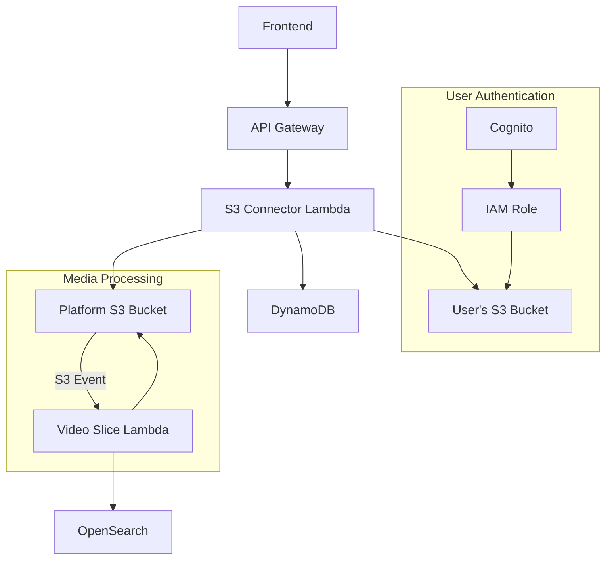
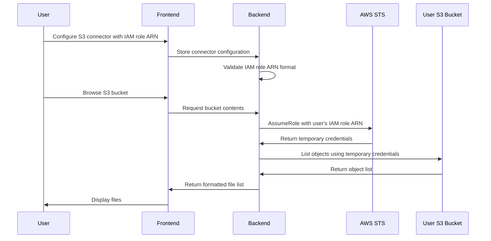
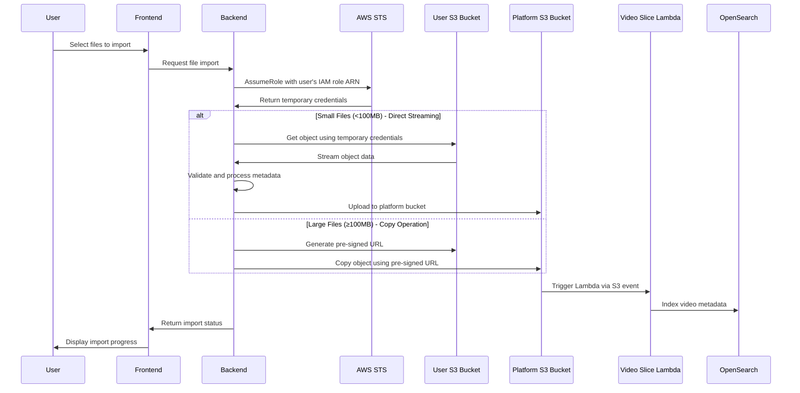

# Amazon S3 Connector Design for Video Search Platform

## 1. Overview

The Amazon S3 connector will allow users to import media files from their own S3 buckets into the video search platform. This feature will support:

1. Authentication using IAM role-based access
2. Browsing and listing files in S3 buckets
3. Searching within S3 buckets
4. Direct streaming of media from S3
5. Downloading media from S3 for processing

## 2. Architecture



## 3. Components

### 3.1 Backend Components

#### 3.1.1 S3 Connector Lambda

A new Lambda function will be created to handle S3 connector operations:
- Managing IAM role configurations
- Listing and searching files in user S3 buckets
- Handling file transfers and streaming
- Integrating with existing video processing pipeline

#### 3.1.2 IAM Role Management

- Store user-provided IAM role ARNs in DynamoDB
- Implement secure role assumption with proper validation
- Implement session management for temporary credentials

#### 3.1.3 Database Schema Updates

New tables/fields in DynamoDB:
- `S3Connectors` table to store connector configurations
- `S3MediaSources` table to track imported media files

#### 3.1.4 API Endpoints

New endpoints to be added to the API Gateway:
```
POST   /connectors/s3                  - Create new S3 connector
GET    /connectors/s3                  - List user's S3 connectors
GET    /connectors/s3/{connectorId}    - Get connector details
PUT    /connectors/s3/{connectorId}    - Update connector
DELETE /connectors/s3/{connectorId}    - Delete connector

GET    /connectors/s3/{connectorId}/buckets           - List buckets
GET    /connectors/s3/{connectorId}/buckets/{bucket}  - List files in bucket
GET    /connectors/s3/{connectorId}/search           - Search files

POST   /videos/import/s3               - Import video from S3
```

### 3.2 Frontend Components

#### 3.2.1 S3 Connector Management UI

- Connector creation form with IAM role configuration instructions
- Connector listing and management interface
- Bucket and file browser

#### 3.2.2 Media Import UI

- Integration with existing upload workflow
- S3 file selection and import interface
- Import progress tracking

## 4. Implementation Details

### 4.1 Authentication Flow



### 4.2 Media Import Flow (Hybrid Approach)



### 4.3 Integration with Existing Processing Pipeline

The S3 connector will integrate with the existing processing pipeline:

1. Files imported from user S3 buckets will be stored in the platform's S3 bucket
2. S3 event notifications will trigger the existing video-slice Lambda function (src/lambdas/video-slice/index.ts)
3. The video-slice Lambda will process the video as it does with directly uploaded videos
4. No changes required to the existing video processing workflow

Key considerations:
- Ensure proper metadata is attached to imported files
- Maintain consistent file structure in the platform S3 bucket
- Preserve existing S3 event patterns and Lambda triggers

### 4.4 File Browsing and Searching

- Implement pagination for large buckets
- Support filtering by file type (video formats)
- Implement server-side search with prefix and regex support
- Display file metadata (size, last modified, etc.)

### 4.5 Direct Streaming

- Use S3 pre-signed URLs for direct streaming
- Implement token-based authentication for secure access
- Support range requests for video seeking

## 5. Security Considerations

### 5.1 IAM Role Requirements

The IAM role provided by users must have:
- Minimum required permissions: `s3:ListBucket`, `s3:GetObject`
- External ID validation to prevent confused deputy issues
- Proper trust relationship configuration

Example IAM policy for users to apply:

```json
{
  "Version": "2012-10-17",
  "Statement": [
    {
      "Effect": "Allow",
      "Action": [
        "s3:ListBucket"
      ],
      "Resource": [
        "arn:aws:s3:::user-bucket-name"
      ]
    },
    {
      "Effect": "Allow",
      "Action": [
        "s3:GetObject"
      ],
      "Resource": [
        "arn:aws:s3:::user-bucket-name/*"
      ]
    }
  ]
}
```

Example trust relationship:

```json
{
  "Version": "2012-10-17",
  "Statement": [
    {
      "Effect": "Allow",
      "Principal": {
        "AWS": "arn:aws:iam::ACCOUNT_ID:role/video-search-service-role"
      },
      "Action": "sts:AssumeRole",
      "Condition": {
        "StringEquals": {
          "sts:ExternalId": "UNIQUE_EXTERNAL_ID"
        }
      }
    }
  ]
}
```

### 5.2 Data Protection

- No storage of AWS credentials
- Temporary session credentials with short expiration (max 1 hour)
- Encryption of role ARNs in database (using KMS)
- Validation of file types before import
- Scanning for malware before processing

### 5.3 Access Control

- Bucket and object access limited to user's own resources
- Proper CORS configuration for direct streaming
- Audit logging of all S3 connector operations
- Rate limiting to prevent abuse

## 6. Implementation Plan

### 6.1 Backend Changes

1. Create new Lambda function for S3 connector operations
2. Update DynamoDB schema for connector storage
3. Implement IAM role assumption and validation
4. Integrate with existing S3 event-based Lambda workflow
5. Add new API endpoints

### 6.2 Frontend Changes

1. Create connector management UI components
2. Implement S3 file browser component
3. Extend existing upload UI to support S3 import
4. Add progress tracking for imports

### 6.3 Testing Strategy

1. Unit tests for IAM role validation and assumption
2. Integration tests for S3 operations
3. End-to-end tests for import workflow
4. Security testing for role-based access

## 7. Code Implementation

### 7.1 Backend Code Structure

```
src/
  lambdas/
    s3-connector/
      index.ts                  # Main handler
      auth.ts                   # IAM role assumption
      operations.ts             # S3 operations
      validation.ts             # Input validation
      db.ts                     # Database operations
      import.ts                 # File import logic with hybrid approach
```

### 7.2 Frontend Code Structure

```
prototype/frontend/
  components/
    connectors/
      S3ConnectorForm.tsx       # Connector creation form
      S3ConnectorList.tsx       # Connector listing
      S3FileBrowser.tsx         # S3 file browser
    indexing/
      S3ImportStep.tsx          # S3 import step in upload workflow
```

## 8. User Experience

### 8.1 Connector Setup Flow

1. User navigates to "Connectors" section
2. User selects "Add S3 Connector"
3. System provides IAM role configuration instructions
4. User configures IAM role in their AWS account
5. User enters role ARN and connector name
6. System validates and saves connector

### 8.2 Import Flow

1. User navigates to "Upload" or "Import" section
2. User selects "Import from S3"
3. User selects connector from dropdown
4. System displays bucket list
5. User browses and selects files
6. User confirms import
7. System shows import progress
8. Imported videos appear in user's video library

## 9. Limitations and Future Enhancements

### 9.1 Initial Limitations

- Limited to video file formats supported by the platform
- No support for folder-level imports (batch operations)
- No automatic synchronization with S3 buckets

### 9.2 Future Enhancements

- Support for other cloud storage providers (Google Cloud Storage, Azure Blob Storage)
- Automatic synchronization of selected folders
- Advanced search capabilities with metadata filtering
- Support for custom metadata from S3 object tags