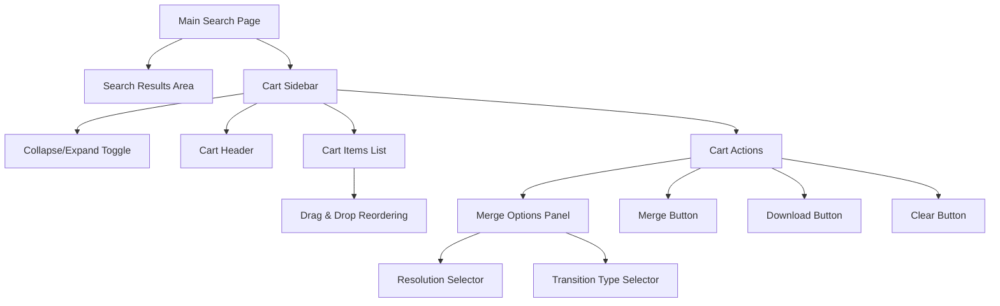
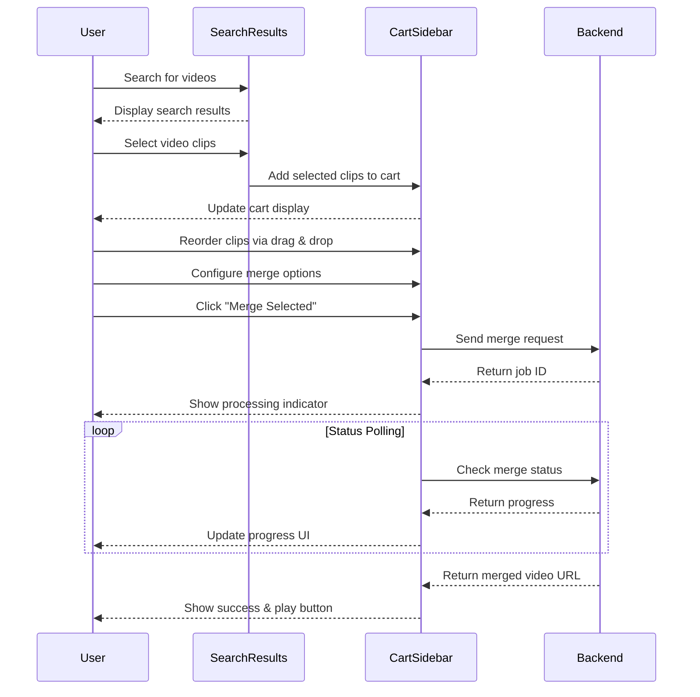
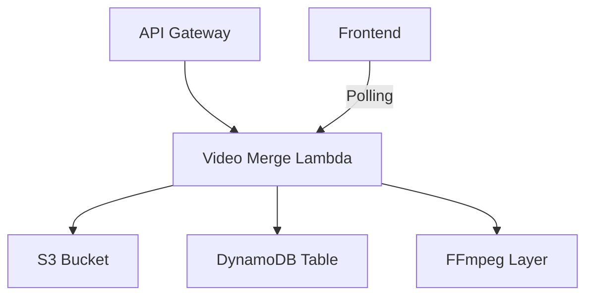
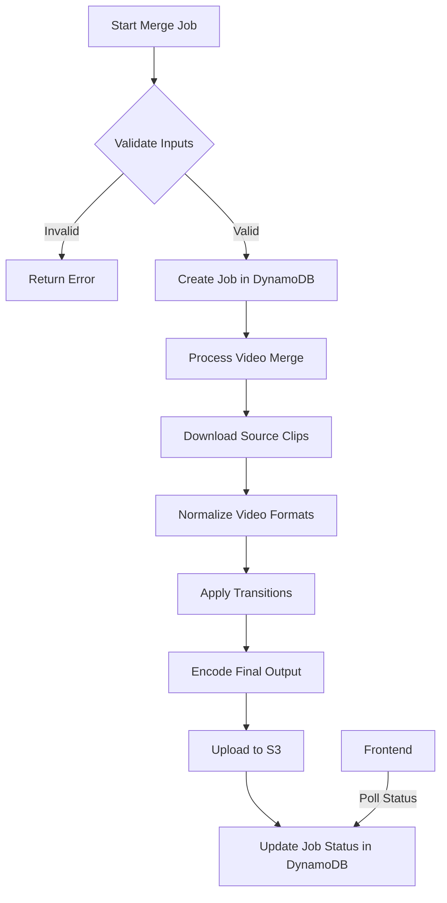

# Video Clip Cart Feature Design

## Overview

This document outlines the design for a new feature that allows users to store selected video clips in a temporary cart/folder. This enhancement will enable users to search with different keywords multiple times and accumulate selected clips from various searches before performing operations like merging, downloading, or exporting.

## Current System Understanding

The current system allows:
1. Searching for videos and viewing results in "View by Clip" or "View by Video" modes
2. Selecting multiple segments from a single video in the "View by Video" mode
3. Performing operations on selected segments (merge, download, export CSV)
4. Merging selected segments into a new video clip

The limitation is that users can only work with segments from one search at a time, and selections are lost when performing a new search.

## Feature Requirements

1. Allow users to store selected video clips in a temporary cart
2. Enable users to perform multiple searches and add clips from each search to the cart
3. Provide a cart interface for viewing and managing stored clips
4. Support operations on cart items (select, merge, download clips/CSV, clear)
5. Integrate with existing backend functionality
6. Support cross-video merging with configurable options
7. Process merge operations within 5 minutes for up to 10 clips

## Technical Design

### 1. Data Structure

```typescript
interface CartItem {
  videoId: string;
  indexId: string;
  segment: VideoSegment;
  addedAt: number; // timestamp
  source: string; // search query that found this clip
  videoTitle?: string; // video title for display
  selectedIndex?: string | null; // selected index from search options
  order?: number; // for explicit ordering in merged output
  transitionAfter?: 'cut' | 'fade' | 'dissolve'; // transition to next clip
  transitionDurationMs?: number; // transition duration
}

interface Cart {
  items: CartItem[];
  lastUpdated: number;
  mergeOptions?: {
    resolution: '720p' | '1080p';
    defaultTransition: 'cut' | 'fade' | 'dissolve';
    defaultTransitionDuration: number;
  };
}

interface MergeJob {
  id: string;
  userId: string;
  status: 'queued' | 'processing' | 'completed' | 'failed';
  progress: number;
  createdAt: number;
  completedAt?: number;
  clips: CartItem[];
  options: {
    resolution: '720p' | '1080p';
    defaultTransition: string;
    outputFormat: string;
    mergedName: string;
  };
  result?: {
    mergedVideoUrl: string;
    thumbnailUrl: string;
    duration: number;
  };
  error?: string;
}
```

### 2. Frontend Components

#### 2.1 UI Layout



#### 2.2 Key UI Components

1. **Cart Sidebar**
   - Fixed position on the right side of the main display area
   - Width: 320-350px (collapsible to ~60px when minimized)
   - Height: Full height of the content area
   - Includes collapse/expand toggle button

2. **Cart Header**
   - Title "Video Clips Cart"
   - Item count badge
   - Collapse/expand toggle button

3. **Cart Items List**
   - Grouped by video source
   - Each item shows:
     - Thumbnail
     - Video title
     - Clip duration
     - Remove button
   - Drag handles for reordering

4. **Merge Options Panel**
   - Resolution selector (720p/1080p)
   - Transition type selector (cut, fade, dissolve)
   - Output format information

5. **Cart Actions**
   - Merge button
   - Download button
   - Clear cart button
   - Progress indicator for merge operations

#### 2.3 User Workflow



### 3. Backend Infrastructure

#### 3.1 Architecture Overview



#### 3.2 Infrastructure Components

1. **Video Merge Lambda**
   - Extract and refactor existing merge code from `src/lambdas/video-upload/index.ts`
   - Enhance to support cross-video merging
   - Add endpoints for:
     - POST `/videos/merge`: Start a merge job
     - GET `/videos/merge/{jobId}`: Check merge job status
     - GET `/videos/merge`: List user's merge jobs

2. **DynamoDB Table**
   - Use existing table structure with additional fields for merge jobs
   - Add status tracking for merge operations

3. **S3 Storage**
   - Use existing bucket structure
   - Add folder for merged videos from different sources

#### 3.3 Video Processing Pipeline



### 4. Processing Time Optimization Strategy

#### 4.1 Lambda Configuration Optimizations

1. **Memory Allocation**:
   - Increase Lambda memory to 10GB (maximum allowed)
   - This significantly improves CPU allocation and processing speed
   - FFmpeg performance scales almost linearly with available CPU

2. **Timeout Configuration**:
   - Set Lambda timeout to 15 minutes (maximum allowed)
   - This provides buffer time beyond our 5-minute target
   - Allows for handling of larger or more complex videos

#### 4.2 Processing Optimizations

1. **Parallel Processing Pipeline**:
   ```mermaid
   flowchart TD
       A[Start Job] --> B[Split Work]
       B --> C1[Download Clip 1]
       B --> C2[Download Clip 2]
       B --> C3[Download Clip 3]
       C1 --> D1[Normalize Clip 1]
       C2 --> D2[Normalize Clip 2]
       C3 --> D3[Normalize Clip 3]
       D1 --> E[Merge Normalized Clips]
       D2 --> E
       D3 --> E
       E --> F[Apply Transitions]
       F --> G[Final Encoding]
       G --> H[Upload Result]
   ```

2. **FFmpeg Optimization Techniques**:
   - Use hardware acceleration when available
   - Implement two-pass encoding for clips > 30 seconds
   - Use single-pass encoding for shorter clips
   - Apply preset configurations based on clip length:
     - Short clips (< 10s): "medium" preset
     - Medium clips (10-30s): "faster" preset
     - Long clips (> 30s): "veryfast" preset

3. **Resolution Downscaling**:
   - Implement adaptive resolution processing
   - For 10+ clips, process at 720p regardless of output setting
   - For 5-9 clips, process at requested resolution (720p/1080p)
   - Upscale final output if needed

4. **Transition Optimization**:
   - Pre-compute transition frames
   - Use simplified transitions for longer videos
   - Implement fade transitions using FFmpeg filters instead of frame-by-frame processing

#### 4.3 Progress Tracking and Timeout Handling

1. **Granular Progress Tracking**:
   ```mermaid
   graph TD
       A[0%: Job Started] --> B[10%: All Clips Downloaded]
       B --> C[40%: All Clips Normalized]
       C --> D[60%: Clips Merged]
       D --> E[80%: Transitions Applied]
       E --> F[90%: Final Encoding]
       F --> G[100%: Upload Complete]
   ```

2. **Timeout Prevention**:
   - Implement heartbeat mechanism to track progress
   - If processing approaches 4 minutes:
     - Reduce output quality
     - Switch to faster encoding preset
     - Skip non-essential processing steps

3. **Fallback Mechanisms**:
   - If processing time exceeds 4.5 minutes, fall back to simpler merge strategy:
     - Cut transitions instead of fades
     - Further reduce resolution if needed
     - Use ultrafast encoding preset

#### 4.4 Performance Benchmarks and Testing

1. **Benchmark Matrix**:
   | Clip Count | Avg Clip Length | Total Duration | Target Processing Time |
   |------------|-----------------|----------------|------------------------|
   | 2-3 clips  | 10-30 seconds   | 30-90 seconds  | < 1 minute             |
   | 4-6 clips  | 10-30 seconds   | 40-180 seconds | < 2 minutes            |
   | 7-10 clips | 10-30 seconds   | 70-300 seconds | < 5 minutes            |

2. **Performance Testing**:
   - Create automated test suite with various video combinations
   - Test with different resolutions, formats, and lengths
   - Measure processing time for each configuration
   - Optimize based on test results

3. **Continuous Monitoring**:
   - Track actual processing times in production
   - Identify patterns in slow-processing jobs
   - Implement automatic optimization based on historical data

## Implementation Plan

### Phase 1: Frontend UI (1 week)
1. Implement cart sidebar layout
2. Add drag and drop reordering
3. Implement collapse/expand functionality
4. Add merge options UI

### Phase 2: Backend Infrastructure (1 week)
1. Extract and refactor existing merge code from `src/lambdas/video-upload/index.ts`
2. Create new file `src/lambdas/video-merge/index.ts`
3. Enhance to support cross-video merging with configurable options
4. Add the new Lambda to `video-search-stack.ts`
5. Configure IAM permissions
6. Set up API Gateway endpoints

### Phase 3: Video Processing (1 week)
1. Implement FFmpeg integration for cross-video processing
2. Add transition effects
3. Configure output format options
4. Implement processing optimizations

### Phase 4: Testing and Refinement (1 week)
1. Run unit and integration tests
2. Optimize performance
3. Fix bugs and issues
4. Deploy to production

## Technical Risks and Mitigations

| Risk | Impact | Mitigation |
|------|--------|------------|
| Performance issues with large carts | High | Implement virtualized lists, pagination, and optimize rendering |
| Browser storage limitations | Medium | Implement cleanup policies, warn users about size limits |
| Merging clips from different videos | High | Implement server-side processing with optimizations |
| Processing time exceeds 5 minutes | High | Implement adaptive quality and fallback mechanisms |
| User confusion with new UI | Medium | Add tooltips, onboarding guidance, and clear visual cues |
| API compatibility | Medium | Ensure backward compatibility, version APIs appropriately |

## Conclusion

The enhanced Video Clip Cart feature will significantly improve the user experience by allowing users to collect and manage video clips across multiple searches. The addition of cross-video merging capabilities with optimized processing will make the platform more flexible and powerful for users working with multiple video clips.

The implementation is designed to be modular and scalable, with a phased approach that delivers immediate value while setting the foundation for more advanced features in the future.
